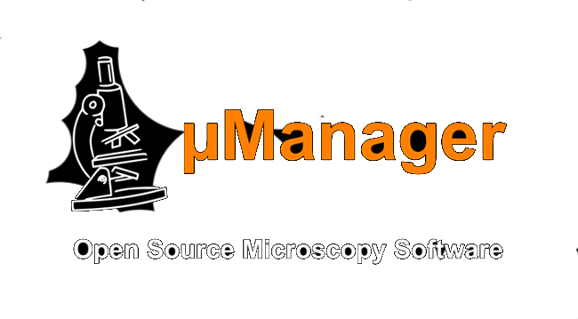

<!-- Header -->
{::nomarkdown}
    <section id="header" style="padding: 0; height: calc(100vh - 48px)">
        

            
             
             
            <ul class="actions special">
            <li><a href="#one" class="button scrolly">Get Started</a></li>
        </ul>
    </section>
{:/}

<!--ImageJ Introduction -->
<section id="one" class="main">
  

    

      

        <header class="major">
          <ul class = "actions special">
            <li><a href="/Micro-Manager_User's_Guide" class="button icon solid fas fa-cogs">Use</a></li>
            <li><a href="/Micro-Manager_Programming_Guide" class="button icon solid fas fa-wrench">Extend</a></li>
            <li><a href="Download_Micro-Manager_Latest_Release" class="button icon solid fas fa-download">Download</a></li>
          </ul>
          <h1>Why µManager?</h1>
        </header>
        

    

  

</section>

<header class="container-whyij">
    

        

          

          

          <h2>Easy to Use</h2>
          

          μManager has a simple and clean user interface, expediting execution of common microscope image acquisition tasks such as time-lapses, multi-channel imaging, z-stacks, and combinations thereof.
          

        

        

        

        <h2>Versatile</h2>
        

        μManager works with microscopes from all four major manufacturers (Leica, Nikon, Olympus and Zeiss), most scientific-grade cameras and many peripherals used in microscope imaging.
        

        

      

      

      <h2>Free &amp; Open Source</h2>
      

      μManager is an open source project hosted on <a href="https://github.com/micro-manager">GitHub</a>, developed and written by both software developers and users.
      

    

  

</header>

<!-- User resources -->
  <section id="dev_resources" class="main style3 special">
   
          <header class="major">
              <h2>User Resources</h2>
          </header>
          
Looking for user resources?

          <ul class="actions special">
              <li><a href="/Device_Support" class="button icon solid fas fa-plug">Device Support</a></li>
              <li><a href="/Micro-Manager_Community" class="button icon solid fas fa-hands-helping">Help</a></li>
          </ul>
          <ul class="actions special">
              <li><a href="https://image.sc" class="button icon solid fas fa-external-link-alt">image.sc Forums</a></li>
              <li><a href="/FAQ" class="button icon solid fas fa-quote-left">FAQ</a></li>
          </ul>
  </section>

  <!-- Developer resources -->
  <section id="dev_resources" class="main style2 special">
   
          <header class="major">
              <h2>Developer Resources</h2>
          </header>
          
Looking for developer resources?

          <ul class="actions special">
              <li><a href="https://github.com/micro-manager" class="button icon solid fas fa-code">Source Code</a></li>
              <li><a href="/Contact" class="button icon solid fas fa-bullhorn">Report a Bug</a></li>
          </ul>
          <ul class="actions special">
              <li><a href="/Micro-Manager_Programming_Guide" class="button icon solid fas fa-terminal">Programming Guide</a></li>
              <li><a href="https://javadoc.scijava.org/Micro-Manager-Studio/org/micromanager/api/MMPlugin.html" class="button icon solid fas fa-terminal">uManager API</a></li>
          </ul>

  </section>

<h3><a href="/Why_Micro-Manager?">HOW IS μMANAGER DIFFERENT?</a></h3>
You have a choice of many commercial packages available, too many, perhaps. Some are produced by microscope or camera manufacturers, others by third parties but they all suffer from the same problems: lack of flexibility and limited device support...

<h3><a href="/Who_should_use_Micro-Manager">IS μMANAGER FOR ME?</a></h3>
With the help of users world-wide μManager has been developed into a professional Microscopy software able to connect to a huge list of devices and effortlessly perform laborious acquisitions.

<h3><a href="/Device_Support">HARDWARE DEVICE SUPPORT</a></h3>
Whether you can use μManager right away or not depends on whether your particular hardware is supported. If not, contact us and express your desire. Check the current hardware list.

<h3><a href="/Micro-Manager_Programming_Guide">EXTENDING μMANAGER</a></h3>
Even if you are not interested in writing software code for your microscope, the open software architecture of μManager will benefit you. For instance, μManager's open device interface lets anyone write code to control microscope-related equipment, resulting a large and growing list of supported equipment. A scripting interface makes it possible to accomplish tasks that can not be executed within the GUI. Lastly, the μManager programming interface can be used from many different environments (including Matlab) to develop new applications, all using the same μManager microscope device control.

<!--Twitter Feed -->


